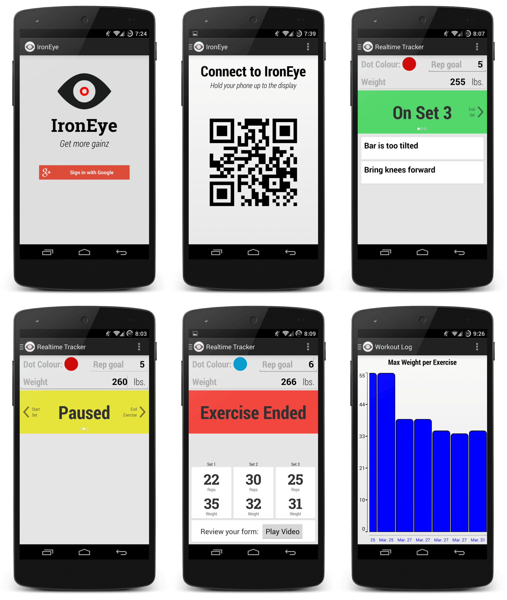

IronEye Android App
=============================

## Description
Created for 4th Year Engineering Science Capstone Design.

The app is to be used in companion with the rest of the IronEye system to provide novice lifters a safe way to learn proper weight lifting technique at their own pace by using a real time display to show errors in the their form, and to serve as a means of tracking and recording workouts.

The mobile app notifies the user when their form is incorrect, and after the workout, it can be used to view statistics, charts, and re-watch their previous workouts.

## Screenshots

